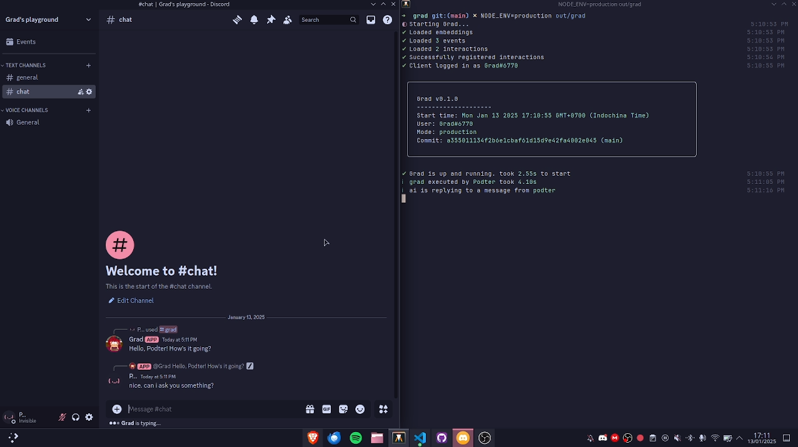
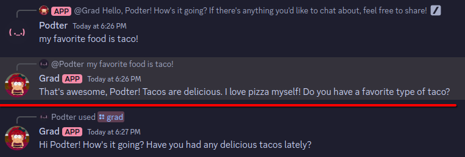

# Grad


Grad is a Discord AI chatbot with tools. She can search the web, use calculator, and remembering user information!

## Getting started

Quickest way to get started is create a Discord bot and invite it to your server.

Clone this repository, then make a copy of the `.env.example` file and rename it to `.env`. Fill in the required fields.

After that, you can use Docker Compose to get the bot up and running:

```bash
docker compose up -d
```

## Configurating

You can change the system prompt by modifying `src/ai/models/prompts/chat.md`.

You can change Grad's personality (what she likes, what she loves) by modifying `GRAD_INFO` array in `src/ai/constants.ts`.

You need to rebuild the project after modifying the files. (`docker compose up -d --build`)

## Building

Make sure you have Bun installed. Then install the dependencies:

```bash
bun install
```

Then build the project:

```bash
bun run build
```

The output binary will be in the `out/grad` or `out/grad.exe`.

## Running

To run the bot, simply run the output binary:

```bash
# Unix
./out/grad

# Windows
./out/grad.exe
```

## Development

To run the bot in development mode, run the following command:

```bash
bun run dev
```

The bot will automatically restart when you make changes to the source code. Good for experimenting with the system prompt, personality, etc.

To get required services up and running during development, you can use pre-configured Docker Compose:

```bash
# Start
bun docker:up

# Stop
bun docker:down

# Clean up
bun docker:rm
```

## More demos

[](https://cloud-qf1jgfhdn-hack-club-bot.vercel.app/02025-01-13_17-10-51.mp4)

> Demo video of Grad in action



> Grad remembering user information

## License

This project is licensed under the MIT license. See the [LICENSE](LICENSE) file for more information.
